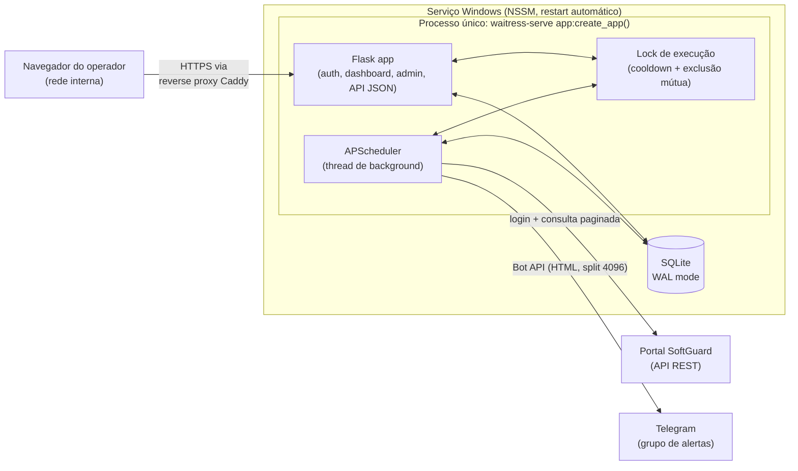
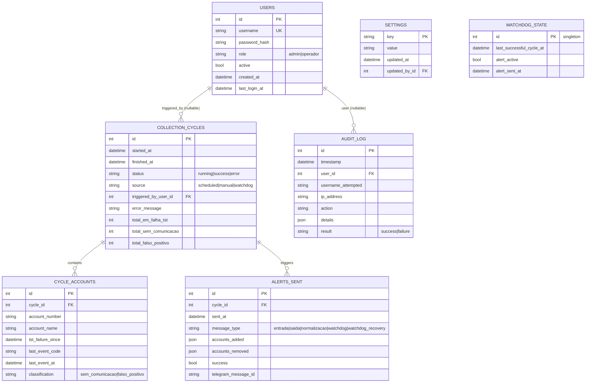

# Arquitetura — Sistema de Monitoramento de Comunicação de Alarmes

Novo Millenium / PowerCentral · documento de proposta técnica, v1

Decisões já validadas com o solicitante:

| Decisão | Escolha |
|---|---|
| Processos | **Serviço único** (web + coletor no mesmo processo Windows) |
| Framework web | **Flask** (application factory, Jinja2 + HTMX) |
| Credenciais reais | Fornecidas pelo usuário; usadas só em runtime/testes pontuais autorizados, nunca commitadas |

---

## 1. Arquitetura proposta

### 1.1 Visão geral



### 1.2 Por que serviço único (em vez de web + worker separados)

O prototipo já resolve o problema real (dados corretos, regra de negócio validada em campo);
o que falta é engenharia de confiabilidade, não escala. Volume esperado: dezenas de contas,
ciclo de 5 minutos, poucos operadores simultâneos. Nesse regime, dois processos comunicando-se
por fila em banco adicionam superfície de falha (processo B não sobe, fila trava, dessincronia
de config) sem ganho perceptível — e a equipe que vai instalar/operar é de suporte, não dev.

Um processo único com **APScheduler em thread de background** dentro do mesmo processo Flask/
waitress resolve todos os problemas listados na seção 4 do prompt (agendamento não depende do
Agendador do Windows; supervisão de processo é 1 serviço NSSM; botão "Atualizar agora" chama a
mesma função Python do ciclo agendado, sob o mesmo lock — sem subprocess, sem fila externa).
Isolamento de falha (requisito de resiliência) é obtido por **isolamento de exceção**, não de
processo: todo ciclo do coletor roda dentro de `try/except` amplo que nunca deixa uma falha do
portal (timeout, 500, sessão expirada) propagar para a thread do Flask — ela vira registro de
`collection_cycles` com `status=error` + log, e o processo continua servindo o dashboard.

Se o volume crescer (centenas de dealers, múltiplas centrais), a extração para um worker
separado é direta, porque a camada `services/` já não conhece Flask nem APScheduler diretamente
— ver seção 1.4.

### 1.3 Por que Flask (não FastAPI)

O NFR do prompt já aponta `waitress` como servidor de produção Windows-friendly — waitress é
WSGI puro, não serve ASGI (o mundo do FastAPI) sem adaptador extra. Como o frontend é
server-rendered (Jinja2 + HTMX, para evitar SPA pesada — também pedido explícito), a vantagem
nativa do FastAPI (async, OpenAPI automático) não se paga aqui: não há chamadas concorrentes de
alto volume, e não expomos uma API pública documentada. Em troca, Flask dá acesso direto a um
ecossistema maduro para exatamente o que falta: **Flask-Login** (sessão), **Flask-WTF** (CSRF),
**Flask-Limiter** (rate-limit no login), todos testados em produção Windows com waitress.

### 1.4 Camadas (pastas)

```
power_central/
  app/
    __init__.py            # application factory (create_app)
    config.py               # Config/DevConfig/TestConfig, carrega .env
    extensions.py            # db, login_manager, csrf, limiter, scheduler (instâncias únicas)
    models/                   # SQLAlchemy — só schema, sem regra de negócio
    domain/                    # PURO — sem Flask, sem requests, sem SQLAlchemy
      classification.py         # regra da seção 6 (função: contas + now -> classificação)
      dates.py                   # parsing de datas mistas (M/D/YYYY AM/PM, ISO, sentinela 1900)
      diffing.py                  # detecção de mudança de conjunto (entrada/saída/normalização)
    integrations/               # I/O externo, sem regra de negócio
      softguard_client.py         # login (3 passos), paginação, retry/backoff, timeout
      telegram_client.py           # envio HTML, split 4096, botão de teste
    services/                     # orquestra domain + integrations + models
      collector.py                 # ciclo completo (RF1)
      alerting.py                   # aplica regra 6.4 e chama telegram_client
      watchdog_service.py           # RF8
      audit_service.py              # RF5
      retention_service.py          # RF9
    web/
      auth/ · dashboard/ · admin/ · api/   # blueprints
      templates/ · static/                  # design system, favicon, logo
    cli.py                        # `flask seed-admin`, `flask collect --dry-run`
  migrations/                     # Alembic
  tests/
    fixtures/                      # respostas SoftGuard fake (cenários da seção 6 e 10)
    unit/ · integration/ · web/
  scripts/  install_service.ps1 · uninstall_service.ps1
  docs/     ARQUITETURA.md (este arquivo) · OPERACAO.md
  .env.example
```

A separação `domain/` (puro, sem I/O) vs `integrations/` (I/O, sem regra) vs `services/`
(orquestração) é o que torna a regra de negócio da seção 6 **testável sem rede e sem Flask** —
`tests/unit/test_classification.py` chama `domain.classification.classificar(contas, agora=...)`
diretamente com fixtures, cobrindo os critérios de aceite (TST há 1h → não aparece; PTB há 1h →
aparece) sem subir servidor nem mockar HTTP.

### 1.5 Fluxo do ciclo do coletor (RF1)

1. Adquire `collector_lock` (não bloqueante); se ocupado, ciclo manual retorna "já em andamento"
   imediatamente (RF4 — segundo clique bloqueado com feedback).
2. Cria linha em `collection_cycles` (`status=running`, `source=scheduled|manual|watchdog`).
3. `softguard_client.login()` — os 3 passos da seção 5, com retry/backoff e timeout em cada
   chamada; sessão revalidada via `IsValid` antes de reusar cookie entre ciclos.
4. Busca paginada de `CuentaByDealer` com o filtro exato da seção 5, até `total`.
5. `domain.classification` aplica a regra 6 conta a conta → `sem_comunicacao` / `falso_positivo`.
6. Persiste `cycle_accounts` (snapshot completo do ciclo — base do histórico e do gráfico).
7. `domain.diffing` compara o conjunto atual de `sem_comunicacao` com o do último ciclo bem-
   sucedido; se mudou (entrou/saiu conta, ou normalizou), `services.alerting` monta e envia o
   relatório Telegram (HTML, ordenado do mais antigo, split em 4096 — RF6).
8. Atualiza `watchdog_state.last_successful_cycle_at`.
9. Fecha `collection_cycles` (`status=success` ou `error` + mensagem); libera o lock.

Erro em qualquer passo (portal fora do ar, timeout, credencial expirada) é capturado, vira
`status=error` no ciclo + log, e **não** dispara alerta de mudança de estado — quem cobre
indisponibilidade prolongada é o watchdog (RF8), evitando ruído de erro pontual.

### 1.6 Dashboard em tempo real (RF2)

Polling leve via HTMX (`hx-trigger="every 30s"`) recarregando partials (stat cards, tabela,
gráfico) — não SSE/WebSocket. Justificativa: o dado não muda mais rápido que o ciclo de 5 min,
então tempo real de verdade não agrega valor; polling é a opção explicitamente permitida pelo
prompt e mantém a stack simples (sem canal persistente para gerenciar em produção Windows).
Exceção: enquanto um ciclo manual está `running`, o partial de status usa `hx-trigger="every 2s"`
até concluir, para dar feedback de andamento (RF4).

### 1.7 Segurança

- **Sessão**: Flask-Login, cookie `HttpOnly` + `SameSite=Lax` + `Secure` (quando atrás de HTTPS),
  regeneração de session id no login.
- **Senha**: `argon2-cffi` (argon2id) para hash de usuários da aplicação.
- **Rate limit**: Flask-Limiter no `/login` (ex.: 5 tentativas/min/IP).
- **CSRF**: Flask-WTF em todo POST.
- **RBAC**: decorator `@roles_required("admin")` nas rotas de admin; acesso negado de operador
  gera `403` **e** registro em auditoria (`unauthorized_access_attempt`) — critério de aceite.
- **Segredos**:
  - `.env` (fora do Git, `python-dotenv`) para infraestrutura fixa: credenciais do portal
    SoftGuard, `SECRET_KEY` (sessão), `ENCRYPTION_KEY` (cifra em repouso), caminho do banco.
  - Tabela `settings` no banco para o que é editável pela interface (RF7): token/chat do
    Telegram gravados **cifrados** (Fernet, chave = `ENCRYPTION_KEY`), nunca exibidos em texto
    puro na tela (mascarados; botão "testar" usa o valor real só em memória, no servidor).
  - `.env.example` versionado (placeholders), `.env` real no `.gitignore`.

### 1.8 Observabilidade

- `logging` padrão com `RotatingFileHandler` por camada (`collector`, `web`, `softguard`,
  `telegram`), sem PII/segredos em log.
- `/health` (JSON): `status`, `db_ok`, `last_cycle_at`, `last_cycle_status`,
  `watchdog_alert_active`, `version`.
- Banner no dashboard quando `watchdog_alert_active=true`.

### 1.9 Deploy (Windows)

`waitress-serve` executando `app:create_app()`, registrado como serviço via **NSSM** com
restart automático em falha. Migrations Alembic aplicadas no `scripts/install_service.ps1`
(ou comando explícito documentado). Primeiro admin via `flask seed-admin` (prompt interativo,
nunca senha hardcoded). HTTPS interno documentado via reverse proxy **Caddy** (certificado
interno ou self-signed) — a aplicação Flask em si não termina TLS.

### 1.10 Retenção (RF9)

Job diário do APScheduler remove `collection_cycles`/`cycle_accounts`/`audit_log` mais antigos
que `settings.retention_days` (padrão 90), em lote, fora do horário de pico.

---

## 2. Modelo de dados



Notas de design:

- **`cycle_accounts`** é o snapshot completo de cada ciclo (não só o estado atual) — é o que
  alimenta o gráfico de evolução e o histórico (substitui o `historico.json` do protótipo por
  algo consultável). O "estado atual" é sempre "o `cycle_accounts` do último `collection_cycles`
  com `status=success`" — sem tabela `current_state` redundante.
- **`estado_envio.json`** do protótipo vira o cálculo de diff entre os dois últimos ciclos bem-
  sucedidos (`domain.diffing`), com o resultado registrado em `alerts_sent` — dá histórico
  auditável de todo alerta enviado (o protótipo não guardava isso).
- **`settings`** é chave-valor (não colunas fixas) para extensão futura sem migration a cada
  novo parâmetro (janela N, códigos comprovadores, intervalo do coletor, cooldown manual, toggle
  de falsos positivos, retenção, credenciais Telegram cifradas).
- **Botão manual (RF4)**: não precisa de tabela de fila — o próprio `collection_cycles` com
  `source=manual` + o lock em memória (seção 1.5) resolve exclusão mútua e cooldown
  (`agora - last_finished_at < cooldown_seconds` → bloqueia com feedback).

---

## 3. Plano de fases

| Fase | Objetivo | Entregas | Marco testável |
|---|---|---|---|
| **0** | Fundação | Estrutura de pastas, `pyproject`/requirements, application factory, `config.py` (.env), modelos + migration inicial (banco vazio), logging, `.env.example`, design tokens CSS base | `pytest` roda verde (teste trivial); `flask db upgrade` cria schema vazio sem erro |
| **1** | Domínio + cliente SoftGuard | `domain/classification.py`, `domain/dates.py`, `domain/diffing.py`; `integrations/softguard_client.py` (login 3 passos, paginação, retry/backoff/timeout) | Suite `tests/unit` cobre a seção 6 e os critérios de aceite (TST 1h → fora; PTB 1h → dentro; falso positivo separado) usando fixtures fake — **sem rede** |
| **2** | Persistência + coletor | Modelos `collection_cycles`/`cycle_accounts`/`alerts_sent`/`watchdog_state`, `services/collector.py`, `services/alerting.py` (Telegram HTML + split 4096), `services/watchdog_service.py`, agendamento APScheduler no processo | `flask collect --dry-run` roda ciclo completo contra fixtures e grava no banco; testes de integração cobrem regra 6.4 (alerta só em mudança, normalização) e watchdog (gap de tempo simulado) |
| **3** | Web: auth + dashboard (leitura) | Blueprints `auth`/`dashboard`/`api`, RBAC, design system (claro/escuro), stat cards, tabela, gráfico, polling HTMX, `/health` | Login funciona, operador bloqueado de `/admin` com registro em auditoria, dashboard reflete dados reais do banco, `/health` responde JSON |
| **4** | Admin + manual + auditoria | Blueprint `admin` (usuários, settings, teste de Telegram), botão "Atualizar agora" com lock/cooldown e feedback, tela de auditoria com filtros | Dois cliques seguidos → segundo bloqueado com mensagem; troca de config reflete no próximo ciclo sem redeploy; auditoria mostra login/manual/config com usuário e IP |
| **5** | Hardening + deploy + docs | `scripts/install_service.ps1` (NSSM), doc de reverse proxy Caddy/HTTPS, `README`/`OPERACAO.md` em PT-BR, retenção automática (RF9) | Checklist completo da seção 10, incluindo simulação de portal fora do ar e sobrevivência a reinício de serviço |
| **6** (fora de escopo agora) | Ponto de extensão | Stub documentado em `integrations/` para futura integração Auvo (sem implementar) | — |

Cada fase termina com testes verdes e é commitada separadamente antes de avançar para a próxima.

---

## 4. Credenciais e integração real

Os valores da seção 12 do prompt (host/porta do portal, `ClientId`, usuário/senha de
integração, token do bot e chat ID do Telegram) foram recebidos nesta conversa. Eles:

- **Não serão commitados** em nenhum arquivo do repositório (`.env` fica no `.gitignore`);
- Só serão usados para uma chamada real ao portal SoftGuard ou envio real ao Telegram
  **mediante confirmação explícita** antes de cada teste ao vivo, já que login real e
  mensagem no grupo de alertas são ações visíveis/com efeito fora deste ambiente;
- Até a Fase 2, todo desenvolvimento e teste roda contra fixtures (dados fake fiéis aos formatos
  e regras da seção 6) — não há necessidade de tocar nas credenciais reais antes disso.
