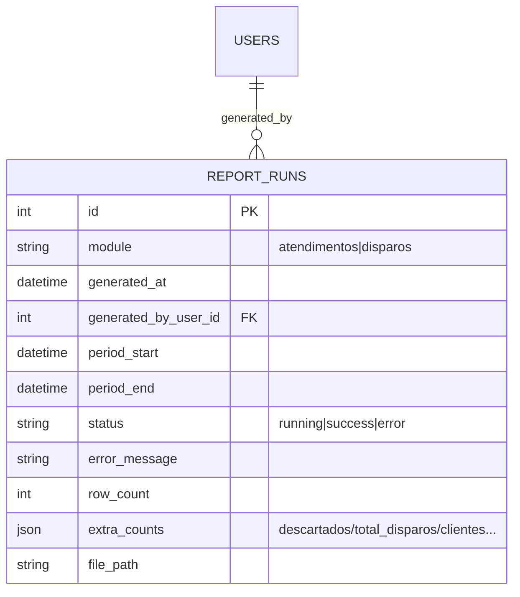

# Módulos de Relatórios — Atendimentos e Disparos Aleatórios

Extensão da arquitetura de [`ARQUITETURA.md`](ARQUITETURA.md) — mesmos
princípios (camadas domain/integrations/services/web, regras de negócio
puras e testáveis sem rede, tudo no banco, auditoria em tudo). Especificação
de origem: complemento "Módulos de Relatórios" do prompt principal.

## 1. Visão geral

Dois módulos novos no mesmo site, com a mesma sidebar/login/papéis:

| Módulo | O que gera | Para quê |
|---|---|---|
| **Atendimentos** | Atendimentos NYE/NYC concluídos no período: cliente, resolução, tempo, monitor + aba DESCARTADOS | Produtividade da equipe de monitoramento |
| **Disparos** | Uma linha por cliente com disparos BUR válidos no período: quantidade, horário de cada disparo, zonas, tempo de conclusão | Locais com disparos aleatórios |

Ambos: seletor de período, botão "Gerar relatório" (execução única por vez,
com feedback), prévia na tela idêntica ao Excel, download .xlsx, histórico
de gerações com re-download, configurações (admin) e auditoria.

## 2. Camadas

### 2.1 `integrations/softguard_client.py` (estender o existente)

Dois métodos novos, mesma sessão/login/retry/paginação já validados:

- `buscar_historico(codigos_alarme, desde, hasta)` →
  `GET /Rest/Search/ReporteHistorico` com `FechaDesde`/`FechaHasta`
  (`MM-DD-YYYY HH:MM:SS`), `CodigosAlarma`, `table=p_recepcion`,
  `OrdenarFecha=DESC`, `Mostrar=5000`, paginação `page/start/limit` até
  `total` (mesmo padrão envelope `rows` já corrigido em produção).
- `buscar_timeline(id_evento)` →
  `GET /Rest/search/EventoTimeLineFull?IdEvento=<rec_iid>&limit=500`.

### 2.2 `domain/atendimentos.py` (puro, sem I/O)

Regras A.3, funções sobre listas de dicts brutos:

- `analisar_timeline(passos)` → início (`etl_cAccion == "Inicio"`),
  fechamento (`etl_iAccionCode == "122"` OU "processado" no texto OU
  `Autoproceso`), monitor (`ope_cnombre`; `Autoproceso` ⇒ "Automático"),
  situação (último `IngresoComentarios` manual até o fechamento, ignorando
  os iniciados por "--- PROCEDIMENTO"), tempo (`HH"H"MM"M"SS"S"` —
  padronizado com o módulo B).
- `classificar_atendimento(...)` → incluído / descartado(motivo) / aberto.
  Descartes: fechamento automático por CLO; resolução indicando arme
  (lista configurável: `ativado`, `armado remotamente`, `armamento
  confirmado`) **com tratamento de negação** ("ainda não foi ativado" NÃO
  é arme). Prefixo do dia (`SEG:`…`DOM:`) na situação.
- `armes_da_conta` (parâmetro de `processar_atendimento`, bug real
  corrigido): a checagem original só olhava a timeline da PRÓPRIA
  ocorrência — se o monitoramento fechasse um NYC/NYE às 14h sem o
  cliente ter armado ainda (resolução tipo "vai ativar depois", que não
  bate com `ativado`/`armado remotamente`/`armamento confirmado`), e a
  loja armasse de verdade só às 21h, o relatório contava isso como falha
  pra sempre — nunca cruzava com o resto do histórico da conta pra ver
  se ela armou depois. Agora `processar_atendimento` recebe os horários
  de eventos de arme reais (CLO/CLV/ROP, mesmos códigos do módulo de
  Disparos) da conta inteira no período; se houver um **depois** do
  fechamento (ou do início, se ainda sem fechamento), descarta com o
  motivo `"Cliente armou depois, às HH:MM (verificado no histórico da
  conta, não só na ocorrência)"` — checagem que tem prioridade sobre
  todas as outras (é o fato mais forte que existe: o cliente armou).

### 2.3 `domain/disparos.py` (puro, sem I/O)

Regras B.3, sobre eventos BUR/CLO/CLV/ROP/OPN/OPV/RCL agrupados por
`rec_iidcuenta`:

- disparo = BUR; conta TODOS os válidos (sem agrupar);
- exclui BUR até **5 min depois** de arme (CLO/CLV/ROP) e até **5 min
  antes** de desarme (OPN/OPV/RCL) — por isso a consulta leva folga de 6
  min em cada ponta do período; RCL (`Alarme Desarmado Remotamente`)
  confirmado como código real de desarme via app, validado contra dados
  de produção (22/07/2026);
- ciclo curto: se um arme é seguido de um desarme em **até 15 min**, todo
  disparo dentro desse ciclo é descartado (`MOTIVO_CICLO_CURTO`) — mesmo
  que fique fora das duas janelas de 5 min acima. Só se aplica quando o
  ciclo inteiro é curto (indício de teste/engano); um disparo ocorrido,
  por exemplo, 10 min após um arme que ficou horas armado **continua
  válido**, pois pode ser uma invasão real;
- ignora zonas com `PANICO`/`PÂNICO` na descrição (sem acento,
  case-insensitive; lista configurável);
- ocorrência: `ALEATORIO`, ou `ALEATORIO E RECORRENTE` a partir de
  `limite_recorrente` (padrão 15);
- zonas distintas por cliente a partir de `_zon_cdescripcion`;
- `horarios`: todos os `quando` dos disparos válidos (não só os
  atendidos), do mais antigo pro mais recente — pedido explícito da
  operação pra ver o horário de cada disparo, não só a quantidade; a
  planilha empilha um por linha na célula (mesmo formato que `zonas`
  já usa), com data porque um período manual pode passar de um dia
  pro outro.

### 2.4 `services/report_service.py`

Orquestra: consulta → domínio → persistência → .xlsx → auditoria.

- Lock próprio por módulo (mesmo padrão do `collector_lock`) — um relatório
  por vez, segundo clique bloqueado com feedback;
- Para Atendimentos: busca timeline por evento (limitando concorrência a
  chamadas sequenciais — volume esperado de dezenas/poucas centenas). A
  chamada a `buscar_historico` pede os códigos de ocorrência
  (`atend_codigos_evento`, padrão `NYE,NYC`) **e** os de arme
  (`dom_disp.CODIGOS_ARME` — `CLO,CLV,ROP`) juntos, no mesmo período; os
  eventos de arme viram `armes_por_conta` (dict conta → horários) e são
  passados pra `processar_atendimento` de cada ocorrência da mesma conta
  — só isso permite ver se a conta armou depois, sem chamada extra à
  API. Fica limitado à mesma janela do relatório: se o cliente armar
  DEPOIS do `hasta` escolhido, esse cruzamento não pega nesse relatório
  — mas com o preset "auto" (janela móvel, padrão) o próximo relatório
  automaticamente começa onde este parou, então um arme tardio é pego
  na geração seguinte; só fica de fato perdido se o operador usar um
  manual estreito e nunca mais rodar sobre aquele intervalo;
- Janela móvel (`janela_disparos`/`janela_atendimentos`, mesmo padrão pros
  dois módulos): `period_end` do último `report_runs` bem-sucedido do
  módulo **cujo period_end já passou** (persistido no banco, auditável) —
  um manual sobre período antigo não reseta o encadeamento pra trás, e um
  manual com fim no futuro (ex.: "hoje" gerado de manhã) não trava os
  automáticos seguintes numa data que ainda não chegou; primeira vez =
  `horas_primeira_execucao` (padrão 24h, configurável por módulo —
  `disp_horas_primeira_execucao`/`atend_horas_primeira_execucao`) para
  trás; override manual na UI (aceita hora/minuto, não só o dia) pros dois
  módulos;
  tempo de conclusão e tempo para ligar via timeline dos disparos com
  `rec_ioperador != 0`, do mais recente para trás até achar,
  respectivamente, fechamento real (regra do módulo A) e uma chamada
  registrada (texto "chamada" na linha do tempo — validado contra timeline
  real, evento MIL-0172, "Chamada Atendida - Bem Sucedida"); cada um cai
  no "X" (preenchimento manual) só se não achar o marcador correspondente;
- .xlsx com **openpyxl** (dependência nova): cabeçalho verde `#21A366`
  texto branco, primeira linha congelada, auto-filtro, quebra de texto
  (SITUAÇÃO / ZONA); Atendimentos com 2ª aba DESCARTADOS
  (`DATA | CONTA | CLIENTE | EVENTO | MOTIVO`);
- Arquivos em `instance/reports/<modulo>/<timestamp>.xlsx`; metadados no
  banco; retenção usa o mesmo `retention_days` (job diário existente
  passa a apagar também `report_runs` antigos + seus arquivos).

### 2.5 Web (`web/reports/`)

Blueprint `reports`, duas páginas (`/relatorios/atendimentos`,
`/relatorios/disparos`) na sidebar para **admin e operador**:

- seletor de período com presets (ontem, últimos 7 dias, manual);
  Atendimentos e Disparos com default "desde o último relatório" (janela
  móvel);
- POST "Gerar relatório" → serviço (lock + auditoria `report_generated`
  com módulo, período e contagens) → redireciona para a prévia;
- prévia paginada com as mesmas colunas do Excel + contadores (Disparos:
  total de disparos e nº de clientes; Atendimentos: nº de descartados);
- download do .xlsx da geração + histórico de gerações (data, usuário,
  período, linhas, re-download do arquivo arquivado);
- configurações A.5/B.5 na tela de Configurações existente (só admin),
  gravadas na tabela `settings` com validação e auditoria como as demais.

## 3. Modelo de dados (adições)

- Config nova (chaves na tabela `settings` existente):
  Atendimentos — `atend_codigos_evento` (NYE,NYC), `atend_incluir_automaticos`
  (false), `atend_incluir_abertos` (false), `atend_resolucao_indica_arme`
  (lista), `atend_horas_primeira_execucao` (24); Disparos —
  `disp_horas_primeira_execucao` (24), `disp_limite_recorrente` (15),
  `disp_ignorar_zonas` (PANICO).
- Janela móvel dos dois módulos: derivada de `report_runs` (sem chave solta).

## 4. Fases (cada uma termina testada e commitada)

| Fase | Entrega | Marco testável |
|---|---|---|
| **R1** | Cliente SoftGuard (2 endpoints) + `domain/atendimentos.py` | Fixtures de timeline reais cobrindo os aceites: CLO/"ativado" descartado com motivo, "ainda não foi ativado" incluído, monitor Automático, prefixo de dia, tempo padronizado |
| **R2** | `domain/disparos.py` | Fixtures cobrindo: BUR 5 min pós-arme/pré-desarme excluído, zona pânico excluída (com/sem acento), contagem sem agrupar, recorrente ≥ 15 |
| **R3** | `report_runs` (migration) + `report_service` + .xlsx (openpyxl) + retenção | Gerar os dois relatórios contra fixtures ponta a ponta; arquivo abre com estilo correto; janela móvel encadeia (`period_start` = `period_end` anterior) |
| **R4** | Páginas web (prévia, histórico, download, configs) + auditoria + visual | Aceites de UI: prévia = Excel, histórico com quem/quando/período, download de arquivado, segundo clique bloqueado, operador gera mas não configura; screenshots claro/escuro |
| **R5** | Corrige Atendimentos contando falha de arme mesmo quando a conta armou depois (bug real relatado: ocorrência fechada às 14h sem indicar arme, conta arma de verdade às 21h) — cruza com `CODIGOS_ARME` da própria conta no período | Unit (`processar_atendimento` com `armes_da_conta`: descarta só com arme *depois* do fechamento, ignora arme antes/de outra conta, prioridade sobre aberto) + integração (`gerar_atendimentos` busca os códigos de arme junto, isolamento por conta) + validação fim a fim reproduzindo o caso real |
| **R6** | Adiciona hora/minuto no período manual de Atendimentos (antes só dia inteiro, igual Disparos já tinha) | Integração web (`datetime-local` nos dois módulos) |
| **R7** | Coluna "HORÁRIOS DOS DISPAROS" no relatório de Disparos (pedido: ver o horário de cada disparo, não só a quantidade) | Unit (`ClienteComDisparos.horarios`) + integração (xlsx com a coluna nova) |
| **R8** | Atendimentos ganha janela móvel ("desde o último relatório"), espelhando o que Disparos já tinha (pedido: evitar reescolher período manualmente e diminuir a chance de um arme tardio escapar do cruzamento da R5) — `janela_atendimentos` + `atend_horas_primeira_execucao` configurável | Integração (`gerar_atendimentos` sem `desde`/`hasta` usa a janela móvel e encadeia com o `report_runs` anterior; manual sobre período antigo não reseta o encadeamento; primeira execução configurável) |

## 5. Riscos/decisões em aberto

- **Formatos reais da API**: campos e formatos de `ReporteHistorico`/
  `EventoTimeLineFull` seguem o HAR descrito no prompt; como no módulo 1
  (caso `rows` vs `data`), a validação final é contra o portal real — o
  primeiro teste ao vivo pode revelar ajustes de parsing (por isso os dois
  endpoints entram na Fase R1, testáveis por fixture e substituíveis).
- **Volume**: `Mostrar=5000` + timeline por evento pode dar muitas chamadas
  em períodos longos; o serviço processa sequencialmente com timeout/retry
  do cliente existente e reporta progresso; se ficar lento na prática,
  otimizamos (cache/threads) numa iteração seguinte.
